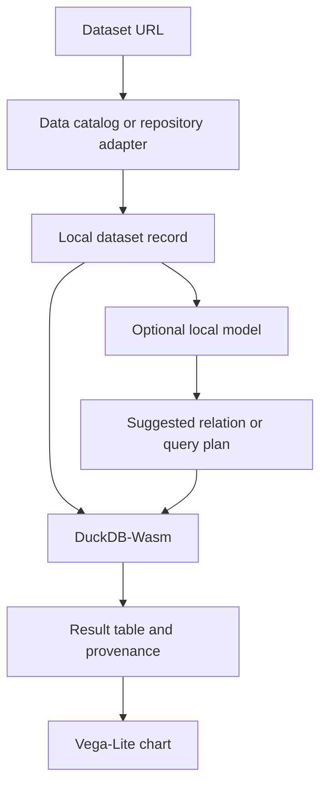

# Architecture

## Product boundary

The application interprets intent, validates fields, and presents results. DuckDB-Wasm calculates every number. A model must never calculate or silently rewrite source values.

## Browser storage

- IndexedDB stores dataset markers, normalized metadata, saved field dictionaries, and future relationship records.
- The browser cache used by Transformers.js stores model artifacts. The browser may evict them.
- Optional semantic vectors are stored separately in IndexedDB and keyed by a SHA-256 digest of canonical catalog text plus model identifier and version. Ordinary workspace exports omit this cache.
- Source dataset files are not copied into IndexedDB in this draft.
- `localStorage` is intentionally not used for data records.

## AI selection order

1. Use deterministic parsing, matching, and DuckDB queries without AI.
2. Probe page-accessible browser AI APIs without creating a session or downloading a model.
3. For future query planning, prefer a ready browser-provided `LanguageModel` session.
4. Treat `downloadable` as a separate state requiring informed user action.
5. Use the app-provided MiniLM model only when the user explicitly requests semantic vector matching.
6. Use an app-provided generative model only if browser prompting is unavailable and evaluation demonstrates that the task requires it.

WebGPU and WebNN indicate local compute capacity. They do not indicate that a model is installed. Firefox's documented internal ML engine is currently privileged browser code and is not treated as a page-accessible API.

## Trust boundaries

- Catalog metadata and data dictionaries remain publisher claims.
- Field types inferred by DuckDB are labelled as inferred.
- A generated plan must reference only fields in the loaded schema.
- Query generation uses an allow-list of aggregations and quotes identifiers.
- Results show the generated SQL and source URL.
- “Related dataset” does not imply join compatibility.

## Phase 6 semantic discovery

Semantic matching is opt-in and local. It may compare the current dataset with saved markers, fetched catalog candidates, and historical query signals. Deterministic catalog scoring and relationship evidence remain visible; semantic similarity never grants comparison or join compatibility.

## Phase 7 large sources and joins

CKAN DataStore-enabled resources use bounded `datastore_search` requests for selected fields, exact filters, sorting, and pagination. The adapter never accepts arbitrary remote SQL. Direct file loads remain behind a browser transfer budget. Join evidence is deterministic, many-to-many candidates are blocked, and all other joins require explicit confirmation.

## Next technical slices

1. Store typed relationships such as `same_series`, `replaces`, `documents`, and `join_candidate`.
2. Catalog search uses the explicitly opened dataset's catalog, bounded pagination, and normalized records. Ranking is deterministic and evidence-based; no search result is treated as a join permission.
3. Add column statistics on explicit request, avoiding automatic full scans of very large CSV files.
4. Add a restricted filter language and suppression-value handling.
5. Add an evaluation harness for natural-language query plans.
6. Only then connect a small local instruction model to the validated plan schema.
